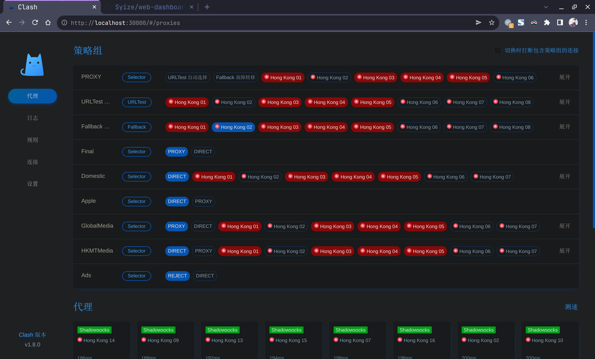

# Web Dashboard using nginx for Clash For Linux

Clash repo site: [click me](https://github.com/Dreamacro/clash)

## How To Use It

1. At first you should install nginx from your distribution's repository. For me, I'm using Arch Linux

```bash
sudo pacman -S nginx
```

2. Clone this repo and put these folders into your nginx's web sources folder
   1. at.alicdn.com
   2. clash.razord.top
3. Add these two configuration file to your nginx's configuration

clash.conf

```nginx
server {
        server_name             localhost;
        listen                  30000;
    
        access_log              /var/log/nginx/clash.log;
        error_log               /var/log/nginx/clash.err;
    
        root                    /path/to/your/clash.razord.top;
        index                   index.html;
}
```

clash_font.conf

```nginx
server {
        server_name             localhost;
        listen                  30001;

        access_log              /var/log/nginx/clash_font.log;
        error_log               /var/log/nginx/clash_font.err;

        root                    /path/to/your/at.alicdn.com;
        index                   index.html;
}
```

4. Reload nginx and check http://localhost:30000

